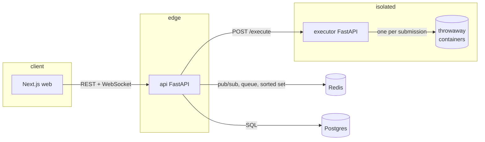

# Code Royale — Architecture

Real-time 1v1 competitive coding. Two players are matched on a topic, get the
same *situational* puzzle, and race to pass every hidden test. First correct
submission wins; ratings move on an Elo curve and the leaderboard updates live.

---

## 1. Services



| Service    | Responsibility                                                                 | Trust |
|------------|-------------------------------------------------------------------------------|-------|
| `web`      | Lobby, match view, live leaderboard. Thin — no game logic.                    | client |
| `api`      | Auth, matchmaking, match/game engine, Elo, leaderboard, the WebSocket gateway | trusted |
| `executor` | Runs untrusted code. **The only component with a Docker socket.**             | isolated |
| `redis`    | Matchmaking queue, pub/sub fan-out, live leaderboard sorted set, presence     | — |
| `postgres` | Source of truth: users, puzzles, matches, submissions, rating history         | — |

**Why `api` and `executor` are separate processes.** Running arbitrary user code
is the riskiest thing the system does. Splitting it out means (a) the
Docker-socket privilege lives in exactly one small service, (b) a crash or
resource spike from grading never touches the matchmaking/WebSocket path, and
(c) the two scale on different signals — `api` on connection count, `executor` on
submission rate.

---

## 2. The match loop

```mermaid
sequenceDiagram
  participant A as Alice (web)
  participant B as Bob (web)
  participant API as api
  participant R as Redis
  participant MM as matchmaker loop
  participant EX as executor

  A->>API: ws queue.join {topic}
  B->>API: ws queue.join {topic}
  API->>R: RPUSH mm:queue:dsa
  MM->>R: LPOP mm:queue:dsa 2
  MM->>API: INSERT match (active), pick random puzzle
  MM->>R: PUBLISH royale {scope:user, type:match.found} x2
  API-->>A: match.found
  API-->>B: match.found
  A->>API: POST /matches/{id}/submit
  API->>EX: POST /execute {source, testcases}
  EX->>EX: throwaway container per testcase (fail-fast)
  EX-->>API: {verdict: PASS, 5/5}
  API->>API: settle(): Elo + rating_history (1 txn)
  API->>R: ZADD leaderboard:global; PUBLISH match.over + leaderboard.update
  API-->>A: match.over (you won)
  API-->>B: match.over + leaderboard.update
```

A match also ends when the clock expires (settled by tests passed, then earliest
submission; a tie is a draw) or when a player disconnects and does not return
within a 30 s grace window.

---

## 3. Realtime fan-out

Every `api` process holds **one** Redis subscription, on a single channel
(`royale`). Domain code never touches sockets — it `PUBLISH`es an envelope:

```json
{ "scope": "match", "id": "<uuid>", "type": "submission.result", "data": { … } }
```

Each process's subscriber receives every envelope and delivers it to whichever of
*its* local WebSockets registered interest in `scope:id`
(`user:<id>`, `match:<id>`, `leaderboard:global`). Consequences:

- **no sticky sessions** — any client can be on any `api` replica;
- **no per-connection Redis subscriptions** — one subscription per process,
  not per socket;
- horizontal scale is "add replicas". The trade is that every replica sees every
  envelope; at this scale that is far cheaper than the alternative and keeps the
  code simple. Sharding by channel prefix is the next step if fan-out volume
  ever justifies it.

---

## 4. Data model

```mermaid
erDiagram
  users ||--o{ submissions : makes
  users ||--o{ rating_history : has
  puzzles ||--o{ puzzle_testcases : contains
  puzzles ||--o{ matches : "is played in"
  matches ||--o{ submissions : receives
  matches ||--o{ rating_history : produces

  users { uuid id PK; string username UK; int rating; timestamptz created_at }
  puzzles { uuid id PK; enum topic; text prompt_md; int difficulty; int time_limit_s }
  puzzle_testcases { uuid id PK; uuid puzzle_id FK; text stdin; text expected_stdout; bool is_sample; int ord }
  matches { uuid id PK; enum topic; uuid puzzle_id FK; uuid player_a FK; uuid player_b FK; uuid winner_id FK; enum status; timestamptz started_at; timestamptz finished_at }
  submissions { uuid id PK; uuid match_id FK; uuid user_id FK; string verdict; int tests_passed; int tests_total; int runtime_ms }
  rating_history { uuid id PK; uuid user_id FK; uuid match_id FK; int old_rating; int new_rating; int delta }
```

Indexes chosen for the actual access paths:

| Index | Serves |
|---|---|
| `users(rating DESC)` | leaderboard cold-load / reconcile |
| `submissions(match_id)` | rendering a match, timeout settlement |
| `matches(status)` | matchmaker's "active matches" reaper scan |
| `matches(player_a)`, `matches(player_b)` | a user's match history |
| `puzzles(topic)` | random puzzle pick at match creation |

`rating_history` is the **audit source of truth** for ratings — `users.rating`
and the Redis sorted set are derived caches that can be rebuilt from it. The
rating write for a finished match — both `users.rating` updates plus both
`rating_history` inserts plus the match row — is a **single transaction**.

---

## 5. RCE security model

Every submission runs in its own container, created from a prebuilt minimal
image and destroyed straight after. Nothing is reused between runs
(`backend/executor/app/sandbox.py`):

| Control | Mechanism | Stops |
|---|---|---|
| No network | `network_mode=none` | exfiltration, callbacks, SSRF |
| Memory ceiling | `mem_limit` + `memswap_limit` equal (swap off) | host memory exhaustion → reported as **MLE** |
| Process ceiling | `pids_limit` | fork bombs |
| CPU cap | `nano_cpus` | noisy-neighbour starvation |
| Immutable disk | `read_only` rootfs; writable `tmpfs` only at `/box`, `/tmp`, size-capped | tampering, filling the disk |
| No privileges | `cap_drop=ALL`, `security_opt=no-new-privileges`, non-root uid 1000 | most container escapes, setuid escalation |
| FD / file-size limits | `fsize`, `nofile` ulimits | giant output files, fd exhaustion |
| Wall-clock timeout | host kills the container | infinite loops → **TLE** |
| Output cap | `--log max-size` + truncation | multi-GB stdout |
| Host concurrency cap | `asyncio.Semaphore` in the grader | too many sandboxes at once |

Code is passed as an **environment variable** (never interpolated into a shell)
and written to the tmpfs by the image entrypoint; stdin is streamed over an
attached socket; stdout/stderr are demultiplexed from the container stream. The
grader is **fail-fast** — the first non-`PASS` testcase ends the run, which
lowers p99 latency and means hidden-case details aren't even computed once the
verdict is decided.

Verified by `backend/executor/tests/test_sandbox.py`: infinite loop → TLE, 1 GiB
alloc → MLE, `socket.connect` → unreachable, fork bomb → contained, write to
`/etc` → read-only error, syntax error → CE.

**Not done (the honest list):** the container still shares the host kernel. The
production step is a stronger isolation layer — gVisor, Kata, or Firecracker
microVMs — plus a seccomp profile and a dedicated pool of executor hosts that run
nothing else.

---

## 6. Scaling story

- **`api` is stateless.** All shared state is in Redis or Postgres, so replicas
  scale horizontally behind a plain load balancer; WebSockets need no session
  affinity because of the pub/sub fan-out (§3).
- **Matchmaker** runs in every replica; pairing is an atomic Redis `LPOP … 2`,
  so at most one replica ever pops a given pair. No leader election needed.
- **`executor`** scales on submission rate, independently. The Docker-per-run
  model is the bottleneck; the same `/execute` contract works unchanged behind a
  queue + a fleet of executor workers.
- **Leaderboard reads** are O(log N) from a Redis sorted set, not a Postgres
  `ORDER BY … LIMIT` on every request; Postgres is hit only on a cold cache or
  the periodic reconcile.

---

## 7. Deliberate cuts

| Cut | Why it's fine for now | Real version |
|---|---|---|
| Python-only runner | proves the model; other languages are just more runner images | one image per language, same sandbox |
| Random puzzle pick | fine for a demo | skill-bracketed selection, no-repeat history |
| Matchmaking is pure FIFO | instant matches with a small pool | rating-banded queue with a widening band over wait time |
| Plain textarea editor | zero cost, not the interesting part | Monaco (drop-in) |
| Auth is minimal (JWT, seeded users) | not what this project is demonstrating | refresh tokens, OAuth, rate-limited login |
| Single Redis / Postgres | — | replicas, PgBouncer, Redis Cluster |
